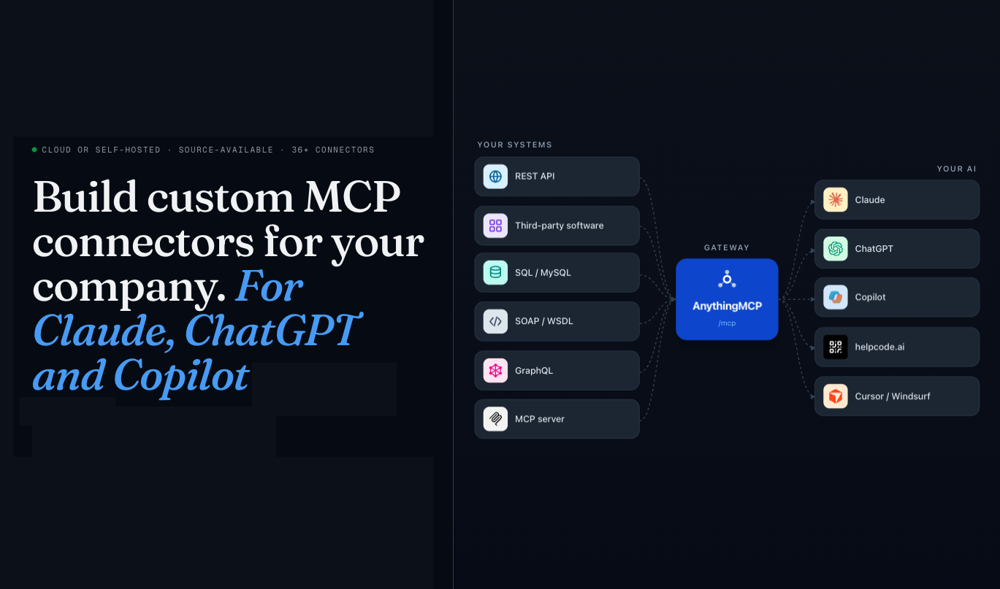

<p align="center">
  <h1 align="center">AnythingMCP — Self-Hosted MCP Server & API Gateway</h1>
  <p align="center">
    <strong>Convert any API into an MCP server in minutes.</strong><br/>
    REST to MCP &bull; SOAP to MCP &bull; GraphQL to MCP &bull; Database to MCP &bull; MCP Gateway &bull; MCP Middleware
  </p>
  <p align="center">
    <a href="https://github.com/HelpCode-ai/anythingmcp/stargazers"></a>&nbsp;
    <a href="https://github.com/HelpCode-ai/anythingmcp/releases"></a>&nbsp;
    <a href="https://github.com/HelpCode-ai/anythingmcp/blob/main/LICENSE"></a>&nbsp;
    <a href="https://hub.docker.com/r/helpcodeai/anythingmcp"></a>&nbsp;
    <a href="https://github.com/HelpCode-ai/anythingmcp/commits/main"></a>
  </p>
</p>

<p align="center">
  <strong>⭐ Star this repo</strong> if you find it useful &middot; <strong>👀 Watch</strong> to get notified about new adapters and releases &middot; <strong>🔱 Fork</strong> to add your own connector
</p>

<p align="center">
  
</p>

<p align="center">
  
  <br/>
  <a href="https://anythingmcp.com/en/video-promo"><strong>Watch the 90-second demo video</strong></a>
</p>

<details>
<summary><strong>📖 Table of Contents</strong></summary>

- [Cloud & Deploy](#cloud--deploy)
- [What is AnythingMCP?](#what-is-anythingmcp)
- [Get Started in 60 Seconds](#get-started-in-60-seconds)
- [Use Cases](#use-cases)
- [Why AnythingMCP?](#why-anythingmcp)
- [How AnythingMCP Compares](#how-anythingmcp-compares)
- [Key Features](#key-features)
- [Pre-configured MCP Connectors](#pre-configured-mcp-connectors)
- [Quick Start](#quick-start)
- [Connect Your AI Client to the MCP Server](#connect-your-ai-client-to-the-mcp-server)
- [Connector Guides](#connector-guides)
- [Architecture](#architecture)
- [FAQ](#faq)
- [Documentation](#documentation)
- [Tech Stack](#tech-stack)
- [Development](#development)
- [Community & Support](#community--support)
- [Star History](#star-history)
- [Contributing](#contributing)
- [License](#license)

</details>

> 🏭 **Origin story** — AnythingMCP started inside a German industrial group that needed AI agents to talk to 15+ legacy systems (ERP, CRM, custom SOAP, on-prem Postgres). Writing one MCP server per system would have taken weeks each; we extracted the common gateway after the third rewrite and have been running it in production for ~6 months.

---

## Cloud & Deploy

[](https://cloud.anythingmcp.com)
&nbsp;&nbsp;
[](https://railway.com/deploy/8-X4WD?referralCode=k30bPV&utm_medium=integration&utm_source=template&utm_campaign=generic)
&nbsp;&nbsp;
[](https://marketplace.digitalocean.com/apps/anythingmcp)

> **Self-hosting instead?** Run `./setup.sh` for the interactive Docker setup. See [Quick Start](#quick-start) below.

---

## What is AnythingMCP?

**AnythingMCP** is a self-hosted, source-available **MCP server** and **API gateway** that turns your existing APIs into [Model Context Protocol (MCP)](https://modelcontextprotocol.io/) tools. Connect **any** API — REST, SOAP, GraphQL, databases, or other MCP servers — and expose them to AI clients like **Claude**, **ChatGPT**, **Google Gemini**, **GitHub Copilot**, **Cursor**, and any other MCP-compatible client.

No SDK. No code changes. Just point, configure, and connect.

**Built-in adapters** ship with the catalog so you get an instant MCP server for popular SaaS and public APIs — DHL, DPD, GLS, Shipcloud, Sendcloud, Deutsche Bahn, DATEV, Weclapp, Xentral, Shopware 6, Personio, Handelsregister, VIES VAT, OpenPLZ, HERE Geocoding, Oxomi and more (full list [below](#pre-configured-mcp-connectors)).

> **Looking for an MCP gateway?** AnythingMCP acts as a universal MCP proxy and API-to-MCP bridge — the missing middleware between your APIs and AI agents.

---

## Get Started in 60 Seconds

```bash
git clone https://github.com/HelpCode-ai/anythingmcp.git
cd anythingmcp && ./setup.sh
# Open http://localhost:3000 — done!
```

See the full [Quick Start](#quick-start) below for detailed configuration options.

---

## Use Cases

- **Talk to your ERP from Claude Desktop** — connect SAP, Oracle, [Weclapp](https://anythingmcp.com/guides/weclapp-erp-to-mcp), [Xentral](https://anythingmcp.com/guides/xentral-to-mcp), [DATEV](https://anythingmcp.com/guides/datev-to-mcp) or any REST/SOAP ERP and query it conversationally
- **Track parcels with AI** — built-in MCP servers for [DHL](https://anythingmcp.com/guides/dhl-tracking-to-mcp), [DPD](https://anythingmcp.com/guides/dpd-germany-to-mcp), [GLS](https://anythingmcp.com/guides/gls-tracking-to-mcp), [Shipcloud](https://anythingmcp.com/guides/shipcloud-to-mcp) and [Sendcloud](https://anythingmcp.com/guides/sendcloud-to-mcp)
- **Automate B2B compliance** — pre-flight every invoice with [VIES VAT validation](https://anythingmcp.com/guides/vies-vat-to-mcp) and [Handelsregister](https://anythingmcp.com/guides/handelsregister-to-mcp) lookups
- **Let AI agents query your production database safely** — read-only database connectors with audit logging
- **Bridge legacy SOAP services to modern AI workflows** — automatic WSDL parsing, no code changes
- **Aggregate multiple MCP servers behind one gateway** — MCP-to-MCP bridge for unified tool access
- **Import your Postman collection and get MCP tools instantly** — zero-config API onboarding

---

## Why AnythingMCP?

| Problem | Solution |
|---------|----------|
| You have REST APIs but AI clients speak MCP | **REST API to MCP** conversion with OpenAPI/Swagger import |
| You have legacy SOAP/WSDL services | **SOAP to MCP** bridge with automatic WSDL parsing |
| You need to query databases from AI agents | **Database to MCP** with auto-generated query tools |
| You want one MCP gateway for all your APIs | **MCP middleware** that aggregates multiple connectors |
| You need an MCP server for DHL/DPD/GLS/DATEV/Weclapp/etc. | **29 pre-built adapters** — install in one click |
| You need auth, audit logs, and role-based access | Built-in **auth, audit log, and RBAC** |

---

## How AnythingMCP Compares

| Feature | AnythingMCP | Custom MCP Server | Other Gateways |
|---------|:-----------:|:-----------------:|:--------------:|
| No-code setup | ✅ Visual editor | ❌ Write code | ⚠️ Config files |
| SOAP / WSDL support | ✅ Built-in | ❌ Manual | ❌ Rare |
| Database connectors | ✅ 7 engines | ❌ Build yourself | ⚠️ Limited |
| Visual tool editor | ✅ | ❌ | ❌ |
| Auth & audit trail | ✅ OAuth2, RBAC, logs | ❌ DIY | ⚠️ Partial |
| Self-hosted or Cloud | ✅ Docker / Railway / DigitalOcean / [Cloud](https://cloud.anythingmcp.com) | ✅ | ⚠️ Often SaaS-only |
| Pre-built SaaS adapters | ✅ 29+ ready-to-use | ❌ Build each | ⚠️ Few |
| Multi-client support | ✅ Claude, ChatGPT, Gemini, Copilot, Cursor | ✅ | ⚠️ Varies |

---

## Key Features

- **5 Connector Types** — [REST](docs/connectors/rest.md), [SOAP](docs/connectors/soap.md), [GraphQL](docs/connectors/graphql.md), [Database](docs/connectors/database.md) (PostgreSQL, MySQL, MariaDB, MSSQL, Oracle, MongoDB, SQLite), [MCP-to-MCP Bridge](docs/connectors/mcp-bridge.md)
- **6 Import Formats** — OpenAPI/Swagger, Postman Collections, cURL commands, WSDL, GraphQL introspection, custom JSON
- **29 Pre-built Adapters** — Install logistics, ERP, HR, public-data and e-commerce MCP servers from a single JSON file — see [list](#pre-configured-mcp-connectors)
- **Dynamic MCP Server** — Tools registered at runtime, no restart needed
- **Visual Tool Editor** — Map parameters to path, query, body, headers visually
- **Database Auto-Tools** — Schema introspection + dynamic query execution out of the box
- **Environment Variables** — Per-connector `{{VAR}}` interpolation, hidden from AI
- **Full Auth** — OAuth2 (PKCE + Client Credentials), Bearer Token, API Key, Basic Auth, Query-Param Auth, WS-Security, Certificates
- **Audit Logging** — Every tool invocation logged with input, output, duration, status
- **Roles & Access Control** — Tool-level whitelisting per custom role
- **Per-User MCP API Keys** — Individual keys with usage tracking
- **Docker Ready** — `docker compose up` and you're running

---

## Pre-configured MCP Connectors

AnythingMCP ships with **29 ready-to-use MCP server adapters** — provide your API credentials at import time and the tools become available to your AI client immediately. Each adapter has its own setup guide on [anythingmcp.com](https://anythingmcp.com/guides) (English, German, Italian).

> 📍 **Heads-up on the catalog:** the starting set leans heavily DACH (Germany / Austria / Switzerland) because that's where we built this in production first. US/UK/APAC SaaS adapters are very welcome as community PRs — there's a [good first issue](https://github.com/HelpCode-ai/anythingmcp/issues/150) walking you through adding one in ~30 minutes (it's a single JSON file).

### Logistics & Shipping

| Connector | Description | Guide |
|-----------|-------------|-------|
| **DHL Tracking** | Worldwide DHL shipment tracking via Unified Tracking API | [DHL MCP Server](https://anythingmcp.com/guides/dhl-tracking-to-mcp) |
| **DPD Germany Tracking** | Public DPD parcel-life-cycle tracking, no API key | [DPD MCP Server](https://anythingmcp.com/guides/dpd-germany-to-mcp) |
| **GLS Track & Trace** | EU-wide GLS parcel tracking, no API key | [GLS MCP Server](https://anythingmcp.com/guides/gls-tracking-to-mcp) |
| **Shipcloud** | Multi-carrier shipping & label aggregator (DHL, DPD, GLS, Hermes, UPS, FedEx) | [Shipcloud MCP Server](https://anythingmcp.com/guides/shipcloud-to-mcp) |
| **Sendcloud** | Multi-carrier EU shipping platform — 40+ carriers under one API | [Sendcloud MCP Server](https://anythingmcp.com/guides/sendcloud-to-mcp) |
| **Deutsche Bahn Fahrplan** | Train timetables, departures, journey planning | [Deutsche Bahn MCP Server](https://anythingmcp.com/guides/deutsche-bahn-to-mcp) |

### ERP, Accounting & Invoicing

| Connector | Description | Guide |
|-----------|-------------|-------|
| **DATEV** | Buchhaltung & tax — used by 90% of German tax consultants | [DATEV MCP Server](https://anythingmcp.com/guides/datev-to-mcp) |
| **Weclapp** | Cloud ERP for German SMBs — customers, orders, articles | [Weclapp MCP Server](https://anythingmcp.com/guides/weclapp-erp-to-mcp) |
| **Scopevisio** | German cloud ERP/CRM — contacts, invoices, projects | [Scopevisio MCP Server](https://anythingmcp.com/guides/scopevisio-to-mcp) |
| **Xentral** | SaaS ERP for e-commerce, wholesale, manufacturing | [Xentral MCP Server](https://anythingmcp.com/guides/xentral-to-mcp) |
| **Billomat** | Online invoicing & bookkeeping for DE SMBs | [Billomat MCP Server](https://anythingmcp.com/guides/billomat-to-mcp) |
| **FastBill** | Invoicing tool for German freelancers and SMBs | [FastBill MCP Server](https://anythingmcp.com/guides/fastbill-to-mcp) |

<details>
<summary><strong>E-commerce, HR, Government, Banking & Construction MCP servers — click to expand</strong> (Shopware 6, Oxomi, ImmobilienScout24, Personio, Kenjo, MFR, VIES VAT, Handelsregister, OpenPLZ, Bundesbank, DESTATIS, NINA, N26, PAYONE, TeamViewer, PlanRadar, HERE Geocoding)</summary>

### E-commerce & Catalog

| Connector | Description | Guide |
|-----------|-------------|-------|
| **Shopware 6** | Storefront API — products, categories, search | [Shopware 6 MCP Server](https://anythingmcp.com/guides/shopware-6-to-mcp) |
| **Oxomi** | Baustoff catalog & media portal (datasheets, CAD, safety sheets) | [Oxomi MCP Server](https://anythingmcp.com/guides/oxomi-to-mcp) |
| **ImmobilienScout24** | German real-estate listings — search, manage, market data | [ImmobilienScout24 MCP Server](https://anythingmcp.com/guides/immobilienscout24-to-mcp) |

### HR & Field Service

| Connector | Description | Guide |
|-----------|-------------|-------|
| **Personio** | Dominant HR platform for DACH SMBs — employees, attendances, absences | [Personio MCP Server](https://anythingmcp.com/guides/personio-to-mcp) |
| **Kenjo HR** | Modern HR platform — employees, departments, recruiting | [Kenjo MCP Server](https://anythingmcp.com/guides/kenjo-to-mcp) |
| **MFR Mobile Field Report** | Field-service operations — work orders, technicians, time tracking | [MFR MCP Server](https://anythingmcp.com/guides/mfr-fieldservice-to-mcp) |

### Government & Public Data

| Connector | Description | Guide |
|-----------|-------------|-------|
| **VIES VAT Validation** | Validate EU VAT numbers — official European Commission API | [VIES MCP Server](https://anythingmcp.com/guides/vies-vat-to-mcp) |
| **Handelsregister** | German commercial register — companies, shareholders, documents | [Handelsregister MCP Server](https://anythingmcp.com/guides/handelsregister-to-mcp) |
| **OpenPLZ Germany** | Postal codes, localities, streets, federal districts (BKG data) | [OpenPLZ MCP Server](https://anythingmcp.com/guides/openplz-to-mcp) |
| **Bundesbank Statistics** | German central bank — exchange rates, monetary, financial markets | [Bundesbank MCP Server](https://anythingmcp.com/guides/bundesbank-to-mcp) |
| **DESTATIS Genesis** | Federal Statistical Office — demographics, economy, trade | [DESTATIS MCP Server](https://anythingmcp.com/guides/destatis-genesis-to-mcp) |
| **NINA Warnung** | Official German emergency alerts — weather, civil protection | [NINA MCP Server](https://anythingmcp.com/guides/nina-warnung-to-mcp) |

### Banking, Payments & Remote

| Connector | Description | Guide |
|-----------|-------------|-------|
| **N26 Open Banking** | PSD2 access — balances, transactions, payment initiation | [N26 MCP Server](https://anythingmcp.com/guides/n26-openbanking-to-mcp) |
| **PAYONE** | Payment processing — transactions, refunds, status | [PAYONE MCP Server](https://anythingmcp.com/guides/payone-to-mcp) |
| **TeamViewer** | Remote-access devices, sessions, users | [TeamViewer MCP Server](https://anythingmcp.com/guides/teamviewer-to-mcp) |

### Construction & Mapping

| Connector | Description | Guide |
|-----------|-------------|-------|
| **PlanRadar** | Construction & real-estate project management — tickets, layers | [PlanRadar MCP Server](https://anythingmcp.com/guides/planradar-to-mcp) |
| **HERE Geocoding** | Worldwide geocoding, autocomplete, place discovery (free tier) | [HERE MCP Server](https://anythingmcp.com/guides/here-geocoding-to-mcp) |

</details>

**Want to add your own?** Create a JSON adapter file in `packages/backend/src/adapters/` (organized by region, e.g. `de/`), register it in `catalog.ts`, and it becomes available to all users. The new `catalog.spec.ts` parametrized test validates every adapter at build time. See the existing adapters and the [Tool Definition Format](docs/tool-definition.md) for the expected schema.

> 👀 **Don't see your favourite SaaS?** [**Open a discussion**](https://github.com/HelpCode-ai/anythingmcp/discussions/categories/ideas) and we'll prioritise the next adapter based on community demand. ⭐ Star and 👀 Watch the repo to be notified when it ships.

---

## Quick Start

```bash
git clone https://github.com/HelpCode-ai/anythingmcp.git
cd anythingmcp
./setup.sh                 # Interactive setup — generates .env, starts Docker
```

The setup script configures everything interactively: deployment mode, domain/SSL, auth, email, Redis, and more. All secrets are auto-generated. First user to register becomes Admin.

**What `setup.sh` handles:**
- Domain and HTTPS — for production domains, enables **Caddy** reverse proxy with automatic Let's Encrypt SSL
- Secrets — generates JWT, encryption keys, and database passwords
- MCP authentication mode — OAuth 2.0, API Key, or both
- Optional SMTP and Redis configuration

> **Prefer manual setup?** Copy `.env.example` to `.env`, edit the values, and run `docker compose up -d`. See the [Deployment Guide](docs/deployment.md) for details.

| Service | Default URL |
|---------|-------------|
| Web UI | `http://localhost:3000` (or `https://yourdomain.com` with Caddy) |
| Backend API | `http://localhost:4000` |
| MCP Endpoint | `http://localhost:4000/mcp` |
| Swagger Docs | `http://localhost:4000/api/docs` |

> **Next step:** Create a connector, import your API spec, and connect your AI client. See the [Connector Guides](#connector-guides) below.

---

## Connect Your AI Client to the MCP Server

AnythingMCP works with any MCP-compatible client. Follow the guide for your AI tool:

| Client | Guide | Transport |
|--------|-------|-----------|
| **Claude Desktop** | [Setup Guide](docs/integrations/claude.md) | Streamable HTTP |
| **Claude Code** | [Setup Guide](docs/integrations/claude.md#claude-code) | Streamable HTTP |
| **ChatGPT** | [Setup Guide](docs/integrations/chatgpt.md) | Streamable HTTP |
| **Google Gemini** | [Setup Guide](docs/integrations/gemini.md) | HTTP / SSE |
| **GitHub Copilot** | [Setup Guide](docs/integrations/copilot.md) | Streamable HTTP |
| **Cursor** | [Setup Guide](docs/integrations/claude.md#cursor) | Streamable HTTP |
| **Any MCP Client** | [Setup Guide](docs/integrations/claude.md#any-mcp-client) | Streamable HTTP |

---

## Connector Guides

Each connector type has dedicated documentation with setup instructions, examples, and best practices:

| Connector | Use Case | Docs |
|-----------|----------|------|
| **REST** | HTTP APIs, OpenAPI/Swagger, Postman | [REST Connector Guide](docs/connectors/rest.md) |
| **SOAP** | WSDL web services, WCF, legacy enterprise APIs | [SOAP Connector Guide](docs/connectors/soap.md) |
| **GraphQL** | GraphQL endpoints with introspection | [GraphQL Connector Guide](docs/connectors/graphql.md) |
| **Database** | PostgreSQL, MySQL, MariaDB, MSSQL, Oracle, MongoDB, SQLite | [Database Connector Guide](docs/connectors/database.md) |
| **MCP Bridge** | Aggregate multiple MCP servers into one | [MCP Bridge Guide](docs/connectors/mcp-bridge.md) |

---

## Architecture

```
                        ┌─────────────────────────────────┐
  Claude Desktop ──────►│                                 │
  ChatGPT ─────────────►│         AnythingMCP             │──── REST APIs
  Gemini CLI ──────────►│      (MCP Middleware)            │──── SOAP Services
  GitHub Copilot ──────►│                                 │──── GraphQL Endpoints
  Cursor ──────────────►│   MCP Protocol (HTTP)           │──── PostgreSQL / MySQL / MSSQL / MongoDB / ...
  Any MCP Client ──────►│                                 │──── Other MCP Servers
                        └─────────────────────────────────┘
                          Caddy (optional) │ automatic HTTPS
                          Next.js UI + NestJS Backend
                          PostgreSQL  │  Redis (optional)
```

**How it works:**

1. **Create a Connector** — Point to your API (REST base URL, WSDL endpoint, GraphQL URL, database connection string) or pick a pre-built adapter from the catalog
2. **Import or Define Tools** — Auto-import from OpenAPI/Postman/WSDL/GraphQL or define manually. Pre-built adapters skip this step.
3. **Connect AI Clients** — Point your MCP client to `http://your-server:4000/mcp`
4. **AI calls tools** — AnythingMCP translates MCP tool calls into actual API requests and returns results

---

## FAQ

### What is an MCP server?

An **MCP server** exposes tools to an AI agent over the [Model Context Protocol](https://modelcontextprotocol.io/) — an open standard from Anthropic. Once connected, the AI can call those tools to read data, run queries, or perform actions on your behalf. AnythingMCP is a self-hosted MCP server that wraps your existing APIs so you don't have to write one from scratch.

### How is AnythingMCP different from writing my own MCP server?

You don't write code. AnythingMCP imports your OpenAPI/Postman/WSDL spec (or you point it at a database) and generates the MCP tools automatically. You also get auth, audit logging, RBAC, and a visual editor on top — features that would take weeks to build per service.

### Can I use AnythingMCP with Claude / ChatGPT / Gemini / Copilot / Cursor?

Yes. Any client that speaks MCP works. See the [Connect Your AI Client](#connect-your-ai-client-to-the-mcp-server) table for direct setup guides.

### Why source-available and not "open source"?

We use the [Business Source License 1.1](LICENSE) (BSL-1.1), the same model as Sentry, MariaDB, CockroachDB and HashiCorp Terraform. The source is fully public, you can read, fork, modify and self-host — but you can't resell it as a managed SaaS without a commercial license. On **2030-03-04** the license **automatically converts to Apache 2.0**, so the code is guaranteed to become OSI-approved open-source. We chose this over MIT/Apache up-front to keep building AnythingMCP sustainably while avoiding the AWS-strip-mining trap. See the [License FAQ](docs/license-faq.md) for plain-language details.

### Is AnythingMCP free?

Yes, for everyone except SaaS resellers. Free for internal company use, personal use, development, testing, evaluation and academic use. The only restriction is offering it as a hosted commercial service to third parties without a commercial license — and even that restriction lifts on 2030-03-04 when BSL converts to Apache 2.0.

### Can I self-host AnythingMCP?

Yes — it ships as a Docker image and runs on your own infrastructure. Run `./setup.sh` or use the [Railway](https://railway.com/deploy/8-X4WD?referralCode=k30bPV) and [DigitalOcean Marketplace](https://marketplace.digitalocean.com/apps/anythingmcp) one-click installs. There's also a managed [Cloud version](https://cloud.anythingmcp.com) if you'd rather not run it yourself.

### Is there an MCP server for [DHL / DPD / GLS / DATEV / Weclapp / Personio / Handelsregister / etc.]?

Yes — see the [Pre-configured MCP Connectors](#pre-configured-mcp-connectors) table above. Each adapter has its own setup guide on [anythingmcp.com](https://anythingmcp.com/guides). If your service isn't there yet, you can add it in 10 minutes by copying an existing JSON adapter and adapting the endpoints.

### What about SOAP and WSDL?

Built-in. AnythingMCP automatically parses WSDL documents and generates one MCP tool per SOAP operation. Useful for legacy enterprise APIs (SAP, Oracle, .NET WCF, banking middleware) that no AI client speaks natively.

### Can the AI access my production database directly?

Yes, with safety. AnythingMCP supports PostgreSQL, MySQL, MariaDB, MSSQL, Oracle, MongoDB and SQLite. Each tool is whitelisted, every invocation is audit-logged, and you can scope a connector to read-only credentials. See the [Database Connector Guide](docs/connectors/database.md).

### How is auth handled?

OAuth2 (PKCE + Client Credentials), Bearer Token, API Key, Basic Auth, query-parameter auth, WS-Security and TLS client certificates are all supported. Credentials are stored AES-256-GCM encrypted at rest. Per-user MCP API keys are issued on top so each AI client gets its own key with usage tracking.

---

## Documentation

| Topic | Description |
|-------|-------------|
| [API Reference](docs/api-reference.md) | Full REST API for connectors, tools, auth, audit |
| [Tool Definition Format](docs/tool-definition.md) | Parameters, endpoint mapping, response mapping |
| [Deployment Guide](docs/deployment.md) | Docker, production setup, reverse proxy, env vars |
| [Authentication](docs/deployment.md#authentication) | OAuth2, JWT, API keys, MCP auth modes |

---

## Tech Stack

| Layer | Technology |
|-------|------------|
| Frontend | Next.js 16, React 19, Tailwind CSS v4 |
| Backend | NestJS 11, TypeScript |
| MCP | @modelcontextprotocol/sdk, Streamable HTTP |
| Database | PostgreSQL 17, Prisma 7 |
| Cache | Redis 7 (optional) |
| Reverse Proxy | Caddy 2 (optional — automatic HTTPS via Let's Encrypt) |
| Auth | JWT, OAuth2, AES-256-GCM |
| Deploy | Docker (single container for app) + Docker Compose |

---

## Development

The easiest way to set up local development:

```bash
./setup.sh    # Choose "Local development" mode
npm run dev
```

Or see the [Deployment Guide](docs/deployment.md#local-development) for manual setup.

---

## Community & Support

- **Questions & Discussions** — [GitHub Discussions](https://github.com/HelpCode-ai/anythingmcp/discussions) — vote on the next adapter, share what you've built, ask for help
- **Bug Reports** — [Open an issue](https://github.com/HelpCode-ai/anythingmcp/issues)
- **Feature Requests** — [Request a feature](https://github.com/HelpCode-ai/anythingmcp/issues/new?labels=enhancement&template=feature_request.md)
- **Need help?** — see [SUPPORT.md](SUPPORT.md) for the full list of channels
- **Built by** [helpcode.ai](https://helpcode.ai) — an independent team in Freiburg, Germany

---

## Star History

<a href="https://www.star-history.com/#HelpCode-ai/anythingmcp&Date">
  <picture>
    <source media="(prefers-color-scheme: dark)" srcset="https://api.star-history.com/svg?repos=HelpCode-ai/anythingmcp&type=Date&theme=dark" />
    <source media="(prefers-color-scheme: light)" srcset="https://api.star-history.com/svg?repos=HelpCode-ai/anythingmcp&type=Date" />
    
  </picture>
</a>

> ⭐ **Like what you see?** [**Star this repo**](https://github.com/HelpCode-ai/anythingmcp/stargazers) — every star helps another developer discover AnythingMCP.

---

## Contributing

We welcome contributions! Please read our [Contributing Guide](CONTRIBUTING.md) before submitting a PR.

For security issues, see [SECURITY.md](SECURITY.md).

---

## License

AnythingMCP is **source-available** under the [Business Source License 1.1](LICENSE) (BSL-1.1). This is _not_ an OSI-approved open-source license — see the [License FAQ](docs/license-faq.md) for a plain-language explanation.

- **Free for**: internal use, personal use, development, testing, evaluation, academic use
- **Not permitted**: offering as a commercial hosted service (SaaS) without a separate license
- **Change Date**: 2030-03-04 — on this date the license automatically converts to [Apache 2.0](https://www.apache.org/licenses/LICENSE-2.0)

For commercial licensing: [info@helpcode.ai](mailto:info@helpcode.ai)

> **Transparency note:** AnythingMCP makes optional network calls to `anythingmcp.com` for license verification and email delivery when SMTP is not configured. No API credentials or tool invocation data is ever sent. See [External Services](docs/deployment.md#external-services) for full details.

Copyright (c) 2026 helpcode.ai GmbH
