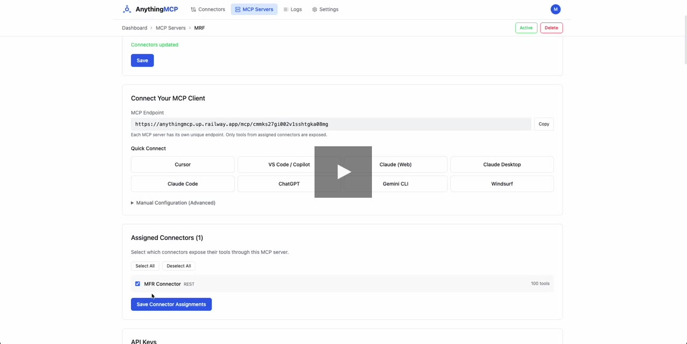
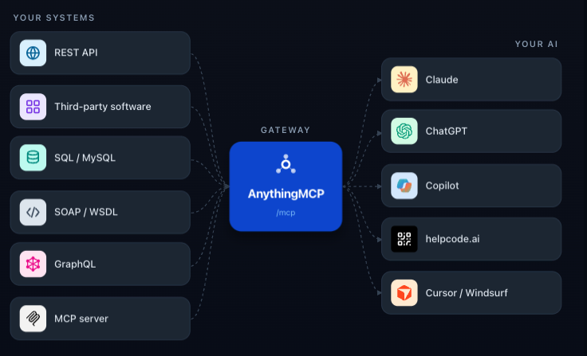

<p align="center">
  
</p>

<h1 align="center">AnythingMCP</h1>

<p align="center">
  <strong>Build custom connectors for Claude and ChatGPT from any API — no code.</strong><br/>
  The self-hosted MCP gateway that turns REST, SOAP/WSDL, GraphQL and SQL endpoints into AI tools, with auth and full audit.
</p>

<p align="center">
  <a href="https://github.com/HelpCode-ai/anythingmcp/stargazers"></a>
  <a href="https://github.com/HelpCode-ai/anythingmcp/releases"></a>
  <a href="https://github.com/HelpCode-ai/anythingmcp/blob/main/LICENSE"></a>
  <a href="https://hub.docker.com/r/helpcodeai/anythingmcp"></a>
  <a href="https://github.com/HelpCode-ai/anythingmcp/commits/main"></a>
</p>

<p align="center">
  <a href="https://cloud.anythingmcp.com"><strong>Try on Cloud →</strong></a> &nbsp;·&nbsp;
  <a href="https://anythingmcp.com/en/video-promo"><strong>Watch 90-sec demo →</strong></a> &nbsp;·&nbsp;
  <a href="https://anythingmcp.com/guides"><strong>Setup guides →</strong></a>
</p>

**AnythingMCP** is a self-hosted, open-source **MCP server** and **API gateway** that turns your existing APIs into [Model Context Protocol](https://modelcontextprotocol.io/) tools. Connect **any** API — REST, SOAP, GraphQL, databases, or other MCP servers — and expose it as a **custom connector** to **Claude**, **ChatGPT**, **Gemini**, **Copilot**, **Cursor**, and any other MCP-compatible client. No SDK. No code changes. Point, configure, connect.

<p align="center">
  <a href="https://anythingmcp.com/demo.mp4">
    
  </a>
</p>
<p align="center">
  <a href="https://anythingmcp.com/demo.mp4"><strong>▶ Watch the 90-second demo</strong></a>
</p>

<details>
<summary><strong>📖 Table of contents</strong></summary>

- [Get started in 60 seconds](#get-started-in-60-seconds)
- [Build custom Claude connectors — no code](#build-custom-claude-connectors--no-code)
- [Turn your API into a ChatGPT App](#turn-your-api-into-a-chatgpt-app)
- [Why AnythingMCP](#why-anythingmcp)
- [How it compares](#how-it-compares)
- [Key features](#key-features)
- [Pre-configured MCP connectors](#pre-configured-mcp-connectors)
- [Connect your AI client](#connect-your-ai-client)
- [Connector guides](#connector-guides)
- [Architecture](#architecture)
- [FAQ](#faq)
- [Documentation](#documentation)
- [Tech stack](#tech-stack)
- [Community &amp; support](#community--support)
- [License](#license)

</details>

---

## Get started in 60 seconds

> **Requires** Docker 24+, `bash`, `openssl`. On macOS, start Docker Desktop first.

```bash
git clone https://github.com/HelpCode-ai/anythingmcp.git
cd anythingmcp && ./setup.sh
# When setup finishes, open http://localhost:3000 and register
# the first user — they automatically become the admin.
```

The interactive setup handles everything: deployment mode, domain & HTTPS (automatic Let's Encrypt via Caddy), secrets, MCP auth mode, optional SMTP/Redis.

> ⚠️ **Register immediately after setup.** The first account to register becomes Admin. If your instance is reachable from the internet during setup, configure firewall rules or bind the UI to `127.0.0.1` until you've created the admin account.

| Service | Default URL |
|---|---|
| Web UI | `http://localhost:3000` |
| MCP endpoint | `http://localhost:4000/mcp` |
| Swagger docs | `http://localhost:4000/api/docs` |

**Or one-click deploy:**

[](https://cloud.anythingmcp.com)
&nbsp;
[](https://railway.com/deploy/8-X4WD?referralCode=k30bPV&utm_medium=integration&utm_source=template&utm_campaign=generic)
&nbsp;
[](https://marketplace.digitalocean.com/apps/anythingmcp)

> **Prefer manual setup?** Copy `.env.example` to `.env` and run `docker compose up -d` — see the [Deployment Guide](docs/deployment.md).

---

## Build custom Claude connectors — no code

Claude supports **custom connectors**: remote MCP servers you add once in *Settings → Connectors*, and that work across Claude.ai, Claude Desktop and Claude Code. AnythingMCP creates that connector **from any API you already have** — without writing an MCP server:

1. Import your API spec (OpenAPI/Swagger, Postman, cURL, WSDL, GraphQL introspection) or pick a pre-built adapter
2. Adjust tool names, descriptions and parameters in the **visual editor** — what the AI sees is up to you
3. Add the gateway URL to Claude as a custom connector (OAuth 2.0 supported out of the box)

Your credentials stay on your infrastructure (AES-256-GCM at rest), every tool call lands in the audit log, and role-based access controls which users see which tools. [Step-by-step guide →](docs/integrations/claude.md)

---

## Turn your API into a ChatGPT App

**ChatGPT Apps and connectors are built on MCP** — and AnythingMCP gives you the MCP backend without writing one. Point it at your REST, SOAP, GraphQL or database endpoint and you get a ChatGPT-ready connector: add it in ChatGPT's connector settings (or use it as the tool layer of an Apps SDK app) and ChatGPT can read and act on your business data.

The same connector works simultaneously in **Claude, ChatGPT, Gemini, Copilot and Cursor** — build once, connect everywhere. [ChatGPT setup guide →](docs/integrations/chatgpt.md)

---

## Why AnythingMCP

| Problem | Solution |
|---|---|
| You have REST APIs but AI clients speak MCP | **REST → MCP** conversion with OpenAPI / Swagger import |
| You have legacy SOAP/WSDL services | **SOAP → MCP** bridge with automatic WSDL parsing |
| You need to query databases from AI agents | **DB → MCP** with auto-generated query tools |
| You want one MCP gateway for all your APIs | **MCP middleware** that aggregates multiple connectors |
| You need an MCP server for DHL/DATEV/Weclapp/… | **175+ pre-built adapters** — install in one click |
| You can't ship credentials to a SaaS gateway | **Runs on your infrastructure** — credentials AES-256-GCM at rest |
| You need auth, audit logs, and RBAC | Built-in **OAuth2, audit log, and role-based access** |

**Typical use cases** — talk to your ERP from Claude ([Weclapp](https://anythingmcp.com/guides/weclapp-erp-to-mcp), [DATEV](https://anythingmcp.com/guides/datev-to-mcp), [Xentral](https://anythingmcp.com/guides/xentral-to-mcp)) · track parcels with AI ([DHL](https://anythingmcp.com/guides/dhl-tracking-to-mcp), [GLS](https://anythingmcp.com/guides/gls-tracking-to-mcp)) · validate invoices ([VIES VAT](https://anythingmcp.com/guides/vies-vat-to-mcp), [Handelsregister](https://anythingmcp.com/guides/handelsregister-to-mcp)) · let agents query production databases safely · bridge legacy SOAP to modern AI · import a Postman collection and get MCP tools instantly.

---

## How it compares

| Feature | AnythingMCP | Custom MCP server | Hosted MCP gateways |
|---|:-:|:-:|:-:|
| No-code setup | ✅ Visual editor | ❌ Write code | ⚠️ Config files |
| SOAP / WSDL support | ✅ Built-in | ❌ Manual | ❌ Rarely supported |
| Database connectors | ✅ 7 engines | ❌ Build yourself | ⚠️ Limited |
| Auth &amp; audit trail | ✅ OAuth2, RBAC, logs | ❌ DIY | ⚠️ Partial |
| Where credentials live | ✅ Your infra (AES-256-GCM) | ✅ Your code | ⚠️ Gateway provider |
| Pre-built SaaS adapters | ✅ 175+ ready-to-use | ❌ Build each | ⚠️ Few |
| Multi-client support | ✅ Claude, ChatGPT, Gemini, Copilot, Cursor | ✅ | ⚠️ Varies |

---

## Key features

- **5 connector types** — [REST](docs/connectors/rest.md), [SOAP](docs/connectors/soap.md), [GraphQL](docs/connectors/graphql.md), [Database](docs/connectors/database.md) (PostgreSQL, MySQL, MariaDB, MSSQL, Oracle, MongoDB, SQLite), [MCP-to-MCP bridge](docs/connectors/mcp-bridge.md)
- **6 import formats** — OpenAPI/Swagger, Postman, cURL, WSDL, GraphQL introspection, custom JSON
- **175+ pre-built adapters** — logistics, ERP, HR, e-commerce, payments, public data — [see catalog](#pre-configured-mcp-connectors)
- **Visual tool editor** — map parameters to path, query, body, headers; rename and describe tools for the AI
- **Dynamic MCP server** — tools registered at runtime, no restart
- **Full auth** — OAuth2 (PKCE + Client Credentials), Bearer, API Key, Basic, WS-Security, client certificates, [LOGIN_TOKEN](docs/connectors/login-token-auth.md) handshakes
- **Audit logging** — every tool call logged with input, output, duration, status
- **Roles &amp; access control** — tool-level whitelisting per custom role, per-user MCP API keys
- **Environment variables** — per-connector `{{VAR}}` interpolation, hidden from the AI
- **Docker ready** — `docker compose up` and you're running

---

## Pre-configured MCP connectors

AnythingMCP ships with **175+ ready-to-use adapters** — provide your API credentials at import time and the tools become available immediately. Every adapter has a setup guide on [anythingmcp.com/guides](https://anythingmcp.com/guides) (English, German, Italian).

| Category | Examples |
|---|---|
| 📦 Logistics &amp; shipping | DHL, DPD, GLS, Shipcloud, Sendcloud, Deutsche Bahn |
| 💼 ERP, accounting &amp; invoicing | DATEV, Weclapp, Xentral, Scopevisio, Billomat, FastBill |
| 🛍️ E-commerce | Shopware 6, WooCommerce, Mercado Libre 🌎, ImmobilienScout24, Oxomi |
| 👥 HR &amp; field service | Personio, HRWorks, Kenjo, MFR Mobile Field Report |
| 🏛️ Government &amp; public data | VIES VAT, Handelsregister, UK Companies House 🇬🇧, DESTATIS, Bundesbank, OpenPLZ, NINA |
| 🏦 Banking &amp; payments | N26, Wise 🇬🇧, PAYONE, Razorpay 🇮🇳, Paystack 🇳🇬 |
| 💬 Messaging &amp; communication | WhatsApp, LINE 🇯🇵, TeamViewer |
| 🎮 Gaming &amp; Web3 | Sorare (18 tools — also the reference for [LOGIN_TOKEN auth](docs/connectors/login-token-auth.md)) |
| 🏗️ Construction &amp; mapping | PlanRadar, HERE Geocoding |

> 📍 The catalog leans DACH (it was born in German production environments) with growing coverage across 🇬🇧 🇮🇳 🇧🇷 🇳🇬 🇯🇵. **Add your own in ~30 minutes**: one JSON file in `packages/backend/src/adapters/`, validated automatically at build time — [good-first-issue walkthrough](https://github.com/HelpCode-ai/anythingmcp/issues/150). Don't see your favourite SaaS? [Open a discussion](https://github.com/HelpCode-ai/anythingmcp/discussions/categories/ideas) — we prioritise by community demand.

---

## Connect your AI client

| Client | Guide | Transport |
|---|---|---|
| **Claude Desktop / Claude Code** | [Setup →](docs/integrations/claude.md) | Streamable HTTP |
| **ChatGPT** | [Setup →](docs/integrations/chatgpt.md) | Streamable HTTP |
| **Google Gemini** | [Setup →](docs/integrations/gemini.md) | HTTP / SSE |
| **GitHub Copilot** | [Setup →](docs/integrations/copilot.md) | Streamable HTTP |
| **Cursor** | [Setup →](docs/integrations/claude.md#cursor) | Streamable HTTP |
| **Any MCP client** | [Setup →](docs/integrations/claude.md#any-mcp-client) | Streamable HTTP |

---

## Connector guides

| Connector | Use case | Docs |
|---|---|---|
| **REST** | HTTP APIs, OpenAPI/Swagger, Postman | [Guide →](docs/connectors/rest.md) |
| **SOAP** | WSDL web services, WCF, legacy enterprise APIs | [Guide →](docs/connectors/soap.md) |
| **GraphQL** | GraphQL endpoints with introspection | [Guide →](docs/connectors/graphql.md) |
| **Database** | PostgreSQL, MySQL, MariaDB, MSSQL, Oracle, MongoDB, SQLite | [Guide →](docs/connectors/database.md) |
| **MCP Bridge** | Aggregate multiple MCP servers into one | [Guide →](docs/connectors/mcp-bridge.md) |
| **LOGIN_TOKEN auth** | APIs that POST credentials → return long-lived bearer | [Guide →](docs/connectors/login-token-auth.md) |

---

## Architecture

<p align="center">
  
</p>

1. **Create a connector** — point to your API (REST base URL, WSDL endpoint, GraphQL URL, DB connection string) or pick a pre-built adapter
2. **Import or define tools** — auto-import from OpenAPI / Postman / WSDL / GraphQL or define manually
3. **Connect AI clients** — point your MCP client to `http://your-server:4000/mcp`
4. **AI calls tools** — AnythingMCP translates MCP tool calls into actual API requests and returns results

---

## FAQ

<details>
<summary><strong>How do I create a custom connector for Claude?</strong></summary>

Run AnythingMCP (self-hosted or [Cloud](https://cloud.anythingmcp.com)), import your API spec or pick a pre-built adapter, then add the gateway URL in Claude under *Settings → Connectors*. No code required — the [Claude guide](docs/integrations/claude.md) walks through it in ~5 minutes.
</details>

<details>
<summary><strong>Can I build a ChatGPT App from my existing API?</strong></summary>

Yes — ChatGPT Apps and connectors are built on MCP, and AnythingMCP generates the MCP backend from your existing API. Add it as a connector in ChatGPT, or use it as the tool layer of an Apps SDK app. See [Turn your API into a ChatGPT App](#turn-your-api-into-a-chatgpt-app).
</details>

<details>
<summary><strong>Do I need to know how to code?</strong></summary>

No. Importing an OpenAPI/Postman/WSDL spec, editing tools in the visual editor, and connecting Claude or ChatGPT are all point-and-click. Code only comes into play if you want to contribute a new adapter (a single JSON file) or self-host with custom infrastructure.
</details>

<details>
<summary><strong>What is an MCP server?</strong></summary>

An MCP server exposes tools to an AI agent over the [Model Context Protocol](https://modelcontextprotocol.io/) — an open standard from Anthropic. Once connected, the AI can call those tools to read data, run queries, or perform actions on your behalf. AnythingMCP is a self-hosted MCP server that wraps your existing APIs so you don't have to write one from scratch.
</details>

<details>
<summary><strong>How is AnythingMCP different from writing my own MCP server?</strong></summary>

You don't write code. AnythingMCP imports your OpenAPI / Postman / WSDL spec (or you point it at a database) and generates the MCP tools automatically. You also get auth, audit logging, RBAC, and a visual editor on top — features that would take weeks to build per service.
</details>

<details>
<summary><strong>Is AnythingMCP really open source?</strong></summary>

Yes. AnythingMCP is licensed under the [GNU AGPL v3](LICENSE), an OSI-approved open-source license — the same model as Twenty, Cal.com, Grafana and Plausible. You can read, fork, modify, self-host and even offer it as a service; the AGPL's network copyleft simply requires that modifications to the software stay open. The only exception is code under `ee/` directories (cloud-operator features), which is commercially licensed and not needed for self-hosting. See the [License FAQ](docs/license-faq.md).
</details>

<details>
<summary><strong>Is AnythingMCP free?</strong></summary>

Yes. AnythingMCP is free software under the AGPL v3 — free for internal company use, personal use, development, testing, evaluation and academic use. If you modify it and run it as a network service for others, the AGPL requires you to make your modified source available to those users. For commercial licensing without copyleft obligations: [licensing@helpcode.ai](mailto:licensing@helpcode.ai).
</details>

<details>
<summary><strong>Can I self-host?</strong></summary>

Yes — it ships as a Docker image and runs on your own infrastructure. Run `./setup.sh` or use the [Railway](https://railway.com/deploy/8-X4WD?referralCode=k30bPV) and [DigitalOcean](https://marketplace.digitalocean.com/apps/anythingmcp) one-click installs. There's also a managed [Cloud version](https://cloud.anythingmcp.com) if you'd rather not run it yourself.
</details>

<details>
<summary><strong>What about SOAP and WSDL?</strong></summary>

Built-in. AnythingMCP automatically parses WSDL documents and generates one MCP tool per SOAP operation. Useful for legacy enterprise APIs (SAP, Oracle, .NET WCF, banking middleware) that no AI client speaks natively.
</details>

<details>
<summary><strong>Is MCP dead now that agents use CLI tools?</strong></summary>

No — but the question conflates two problems. CLI is the right call when the model already knows the tool from training (`git`, `docker`, `kubectl`), the agent is acting for the builder, and a CLI actually exists. MCP wins when you need per-user auth, scoped permissions, audit logs, multi-tenant isolation, or SaaS integrations without a CLI. The mature pattern in 2026 is **hybrid**: CLI for local/dev tools, MCP for SaaS / multi-tenant / compliance-bound integrations. Full decision matrix on [anythingmcp.com/vs/cli](https://anythingmcp.com/vs/cli).
</details>

<details>
<summary><strong>Can the AI access my production database directly?</strong></summary>

Yes, with safety. PostgreSQL, MySQL, MariaDB, MSSQL, Oracle, MongoDB and SQLite are supported. Each tool is whitelisted, every invocation is audit-logged, and you can scope a connector to read-only credentials. See the [Database Connector Guide](docs/connectors/database.md).
</details>

<details>
<summary><strong>How is auth handled?</strong></summary>

OAuth2 (PKCE + Client Credentials), Bearer Token, API Key, Basic Auth, query-parameter auth, WS-Security and TLS client certificates are all supported. Credentials are stored AES-256-GCM encrypted at rest. Per-user MCP API keys are issued on top so each AI client gets its own key with usage tracking.
</details>

---

## Documentation

| Topic | Description |
|---|---|
| [API reference](docs/api-reference.md) | Full REST API for connectors, tools, auth, audit |
| [Tool definition format](docs/tool-definition.md) | Parameters, endpoint mapping, response mapping |
| [Deployment guide](docs/deployment.md) | Docker, production setup, reverse proxy, env vars |
| [Authentication](docs/deployment.md#authentication) | OAuth2, JWT, API keys, MCP auth modes |

---

## Tech stack

Next.js 16 + React 19 (frontend) · NestJS 11 + TypeScript (backend) · `@modelcontextprotocol/sdk` with Streamable HTTP · PostgreSQL 17 + Prisma 7 · Redis 7 (optional) · Caddy 2 (optional, automatic HTTPS) · Docker Compose.

**Local development:** `./setup.sh` (choose "Local development"), then `npm run dev` — or see the [Deployment guide](docs/deployment.md#local-development).

---

## Community &amp; support

- 💬 **Questions &amp; discussions** — [GitHub Discussions](https://github.com/HelpCode-ai/anythingmcp/discussions) — vote on the next adapter, share what you've built
- 🐛 **Bugs / 💡 features** — [Issues](https://github.com/HelpCode-ai/anythingmcp/issues) · 🆘 [SUPPORT.md](SUPPORT.md)
- 🏢 Built by [helpcode.ai](https://helpcode.ai) in Freiburg, Germany — AnythingMCP was extracted from a production system connecting AI agents to 15+ legacy systems (ERP, CRM, SOAP, on-prem databases) in a German industrial group, and open-sourced because the catalog grows faster as a community. AI-assisted development, human-reviewed: see [AUTHORS.md](AUTHORS.md).

## Star history

<a href="https://www.star-history.com/#HelpCode-ai/anythingmcp&Date">
  <picture>
    <source media="(prefers-color-scheme: dark)" srcset="https://api.star-history.com/svg?repos=HelpCode-ai/anythingmcp&type=Date&theme=dark" />
    <source media="(prefers-color-scheme: light)" srcset="https://api.star-history.com/svg?repos=HelpCode-ai/anythingmcp&type=Date" />
    
  </picture>
</a>

> ⭐ **Like what you see?** [Star this repo](https://github.com/HelpCode-ai/anythingmcp/stargazers) — every star helps another developer discover AnythingMCP.

## Contributing

We welcome contributions! Please read our [Contributing guide](CONTRIBUTING.md) before submitting a PR. For security issues, see [SECURITY.md](SECURITY.md).

## License

AnythingMCP is **open source** under the [GNU Affero General Public License v3](LICENSE) (AGPL-3.0-only) — see the [License FAQ](docs/license-faq.md) for a plain-language explanation.

- ✅ **Free for** — internal use, personal use, development, testing, evaluation, academic use, self-hosting
- 🔄 **Copyleft** — if you modify AnythingMCP and offer it over a network, you must share your modified source with those users
- 🏢 **`ee/` directories** — cloud-operator code under `ee/` is licensed under the [AnythingMCP Commercial License](packages/backend/src/ee/LICENSE) and is not required for self-hosting

See [LICENSING.md](LICENSING.md) for the full breakdown (including earlier BUSL releases). For commercial licensing: [licensing@helpcode.ai](mailto:licensing@helpcode.ai)

> **Transparency note** — AnythingMCP makes optional network calls to `anythingmcp.com` for license verification and email delivery when SMTP is not configured. No API credentials or tool invocation data is ever sent. See [External services](docs/deployment.md#external-services) for full details.

Copyright © 2026 helpcode.ai GmbH
